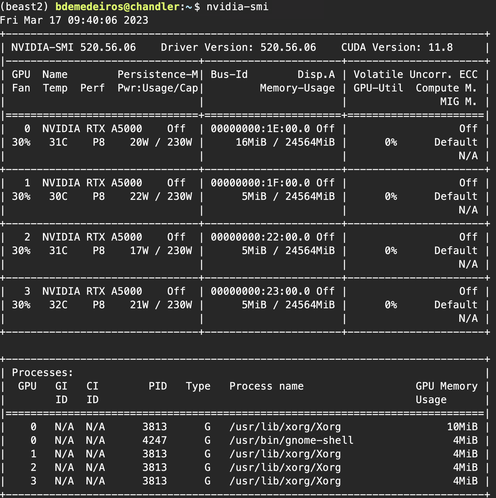

# Installing BEAST2 with GPU support

[BEAST2](https://www.beast2.org) can run much faster with a GPU, which requires a [BEAGLE](https://github.com/beagle-dev/beagle-lib) library compiled with GPU support. This is not the version that you can currently install with [Anaconda](https://anaconda.org), so here we will show how to install the requirements with Anaconda and then compile and install BEAGLE to you conda environment.

Currently (2023) the only GPU server at the Field Museum is **Chandler**, so these instructions will only work ins that server.


## 1. Checking NVIDIA driver version

You can check the version of NVIDIA drivers installed with the following command in the terminal window:

```sh
nvidia-smi
```

This will output something like this (screenshot in March 2023):


In this case, it shows that the CUDA Version is 11.8 and the CUDA driver is 520.56.06. Use this [link](https://docs.nvidia.com/deploy/cuda-compatibility/#minor-version-compatibility) in NVIDIA website to check which CUDA toolkit is compatible with the driver version we have.

As of March 2023, this is the table found in the website:


This means that we need a CUDA driver of version 525.60.13 or above for a CUDA 12.x toolkit, which is above the version we currently have (520.56.06). Therefore, we will need to install the CUDA toolkit version 11.x (that is, below version 12, but it could be any subversion of 11).


## 2. Installing dependencies with Anaconda

Now that we know the version of the cudatooljit we need, we can use Anaconda to set up an environment to run BEAST2. Let's name our enviroment `beast2`. Notice that we are constraining the version of cudatoolkit to maintain compatibility with our server NVIDIA driver:

```sh
conda create -n beast2  -c bioconda -c conda-forge  python=3.9  beast2 gcc cmake autoconf automake libtool subversion pkg-config  cudatoolkit-dev=11  setuptools cmake make ninja
```

This will create a new conda environment with the packages we need, and we can activate it using
```sh
conda activate beast2
```


## 3. Installing BEAGLE GPU to the conda environment

After activating the environment, let's compile and install BEAGLE with GPU support to our environment. First, let's download the BEAGLE github repositoru to our home folder:

```sh
conda activate beast2
cd ~
git clone https://github.com/beagle-dev/beagle-lib.git
cd beagle-lib
mkdir -p build && cd build
cmake .. -G Ninja -DCMAKE_BUILD_TYPE=Release -DBUILD_CPU=ON -DBUILD_CUDA=ON -DBUILD_OPENCL=OFF
ninja
ninja install
```

This is slightly different from the instructions in BEAGLE github repository, to make sure that the BEAGLE library is installed within this conda environment and not to your home folder.

If everything worked well, you will see several messages during compilation, they should metion that CUDA was found, like this:


Now you can delete the github repository:
```sh
cd ~
rm -r beagle-lib
```


## 4. Running BEAST2 with GPU support

To run BEAST2 with GPU support, you will need to activate your conda environment and include the flag `-beagle_GPU`. For example, if you are in a directory containing a BEAST `xml` file, you could use:

```sh
conda activate beast2
beast -statefile checkpoint -beagle_GPU -seed 45684121 *.xml
```

⚠️ Note: The latest version of BEAST2 available via conda is v2.6.3.
If you’re using a newer version like v2.7.7, download it manually from the [BEAST2 website](https://www.beast2.org/), then extract it:
```sh
tar fxz BEAST.v2.7.7.Linux.x86.tgz
```

To run it, use the full path to the BEAST executable:

```sh
./beast/bin/beast -statefile checkpoint -beagle_GPU -seed 45684121 *.xml
```

### Optimizing GPU Usage

To distribute the analysis across multiple GPUs (e.g., 4), add:
```sh
-beagle_order 1,2,3,4
```

To further optimize performance, you can also add:
```sh
-instances 4
```

This splits the alignment into 4 parts, allowing better task distribution across GPUs. You can experiment with the number of instances for best performance, but be aware that too few causes uneven workload, too many increases CPU overhead.

> We tested 6 different values for the `-instances` parameter using a short MCMC run (2 million generations). Based on runtime performance, I selected **4 instances** as the most efficient setting for this dataset and server configuration:
>
> | Instances | Runtime (sec) |
> |-----------|----------------|
> | 4         | **9,577**      |
> | 8         | 12,646         |
> | 16        | 16,569         |
> | 32        | 12,933         |
> | 48        | 16,016         |
> | 64        | 24,036         |


# Workflow contributors
Created: B. de Medeiros March 2023

Updated: D. Souza, April 2025
