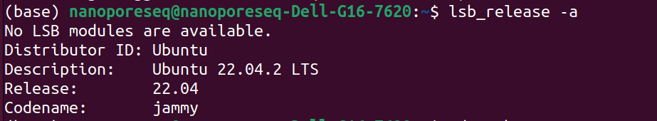

# Installing MinION with Guppy GPU on Ubuntu 22.04.2 LTS


## Step 1 - Figuring out Ubuntu version 

```bash
lsb_release -a
```
it will retusrn something like this:

No LSB modules are available.
Distributor ID:	Ubuntu
Description:	Ubuntu 22.04.2 LTS
Release:	22.04
Codename:	jammy


