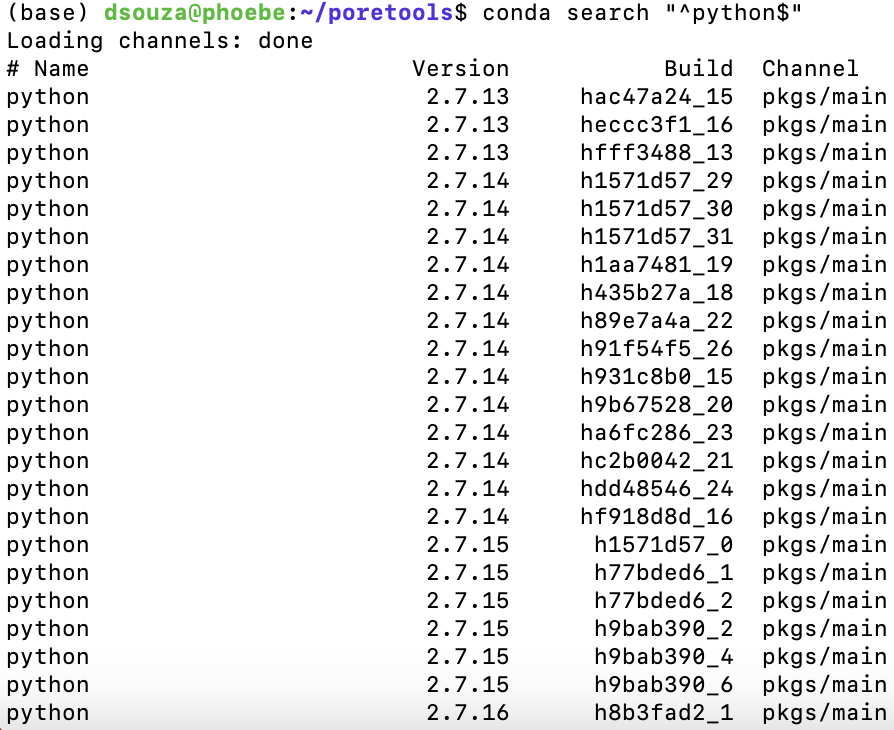

# Installation of poretools using Conda on Phoebe

The installation of `poretools` using [Conda](https://anaconda.org/bioconda/poretools) requires Python 2.7. The current default version of Python on Phoebe is Python 3, so you will need to explicitly specify that you want to use a different minor version of Python in order to install poretools. You can do that by creating a new Conda environment with Python 2.7.


## 1. Check the available versions of Python that are compatible with Conda by running the following command:

```
conda search "^python$"
```

This will display a list of available Python versions on Phoebe, as below: 




## 2. Create a new Conda environment with a Python version 2.7. 

In this case, we are creating an environment with `Python 2.7.18`, which is compatible with poretools installation:

```
conda create -n py2env python=2.7.18
```


## 3. Activate the newly created Conda environment:

```
conda activate py2env
```

By creating this separate Conda environment with Python 2.7.18, you can isolate your package installations and dependencies for different Python versions available on Phoebe. It allows you to switch between different environments easily and ensures compatibility with the specific Python version you need.


## 4. Install poretools using Conda:

```
conda install poretools
```


### Example: using poretools to create a tarball from a set of FAST5 files

```
poretools combine -o foo.fast5.tar.gz /directory/to/your/data/*.fast5
```

In this example, `/directory/to/your/data/` can be replaced with the directory containing the FAST5 files you want to combine as a .tar.gz file.


## References
poretools: a toolkit for working with nanopore sequencing data from Oxford Nanopore
https://poretools.readthedocs.io/en/latest/index.html
