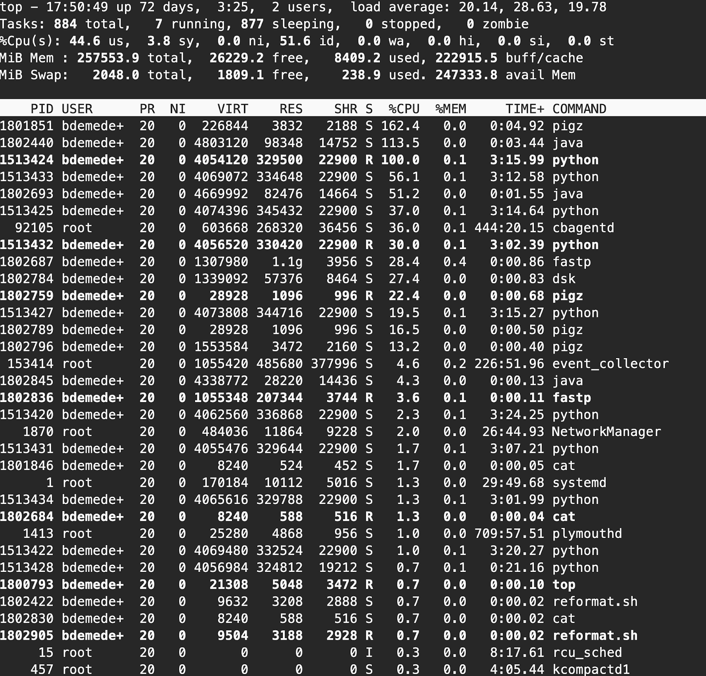
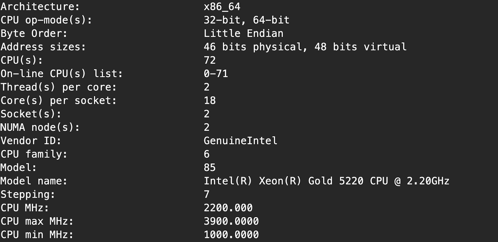

# Running jobs in the FMNH servers


Below there are general instructions to run jobs. For specific instructions on particular programs, see:
 * [Jupyter](docs/jupyter.md)
 * [fastai/pytorch](docs/fastai_pytorch.md)


## Linux Screen

The best way to run a job is to use a Linux program named screen (https://linuxize.com/post/how-to-use-linux-screen/)

Screen works like different Windows in a graphical user interface, but for the command line. You can start a new session, run something, and then "detach", which means you walk away and leave it running in the background. When you come back, you can reattach and resume your work. 


### Set up

Screen is already installed in the systems, but you can configure it for your purporses. One recommended configuration is to allow mouse scrolling of the screen while using it, which does not work correctly by default. To do this, you need to edit the file `~/.screenrc`, which you can do using this command:
```bash
echo termcapinfo xterm* ti@:te@ >> ~/.screenrc
```

### Starting a new session

To start a new session:

```bash
screen -S my_session
```

where `my_session` is a name that you choose. When you do this, it works like you opened a new terminal window, and you can run whatever program you need. 

### Detaching from a session

Once your program is running, you can press `ctrl+a` to tell linux you will input a screen command, and then press `d`
This means that you want to "detach", leave it running in the background. You can then exit the server and the program will keep running.

### Listing sessions

To list the currently existing sessions:
```bash
screen -ls
```
The output will look something like this:


In this case, there is screen running named varkoder

### Reattaching

You can reattach to a session using:

```bash
screen -r my_session
```

### Killing a session

When you are done with working with a screen session, you can kill it in two ways:

To kill an attached screen: use `ctrl+a` followed by `k`

To kill a detached screen: use `screen -ls` to see the screen name or number and then use `screen -S [screen name] -X`

where `my_session` is the name of the session. This will take you back to the screen.

## Checking usage

Because the FMNH are shared use and do not have a scheduler system, make sure there are sufficient free cores and memory for the job that you need to run before starting.

### Checking CPU and memory usage
To check CPU and memory usage, you can use the command `top`. This will show you usage in real time, for example looking like this:

In this case, CPU usage is around 45% and there is about 26000 KB of free memory, or about 26 GB. To exit top, you can use `Ctrl+C`


`top` just shows the % usage of CPUs, but not the number of CPUs. To get that, you can consult the Grainger Bioinformactics Center documentation or run the command lscpu. For example, running this on Chandler shows 72 CPUs:



### Checking GPU usage
To check GPU usage, the command is `nvidia-smi`. A typical output would be something like this:


In this example, none of the four GPUs are not being heavily used.

## Good file organization practices

Because you will be mostly running programs in the background, it is a good idea to maintain a log of everything you did for better reproducibility. Avoid launching programs directly from an interactive session, and instead write scripts to run them, launching the scripts. Also, remember to capture the output of all programs into a file.

For example, let's imagine that you want to run BEAST with the input file `beast.xml`. A suggestion of how to do this would be to structure your project with a separate folder for input data, results, and scripts. For example:
* beast_project/
  * data/
    * beast.xml
  * scripts/
    * run_beast.sh 
  * results/      

The contents of run_beast.sh could be the following, assuming that you have installed BEAST previously in a conda environment named `beast2` ([see installation instructions here](../install_instructions/BEAST2_with_GPU_support.md)):

```bash
#!/bin/bash
conda activate beast2 
cd results
beast -beagle_GPU ../data/beast.xml 2>&1 | tee results/beast.out
echo DONE
```

This script:

1. activates the beast2 conda environment
2. changes to the `results` folder so that results are saved there
3. calls beast with GPU support and the xml file in the `data` folder as input
4. uses `2>&1` to join standard output and standard error in a single file
5. pipes this output to the linux program `tee`, which enables you to save the output to a file and at the same time see it on your screen. In this case, the output will be saved to the file `beast.out`
6. print `DONE` when the program finishes running

To run the script, you have to start a screen session, `cd` into `beast_project` folder and run:
```bash
bash scripts/run_beast.sh
```

Now you can leave it running in the background and come back to check results later.


