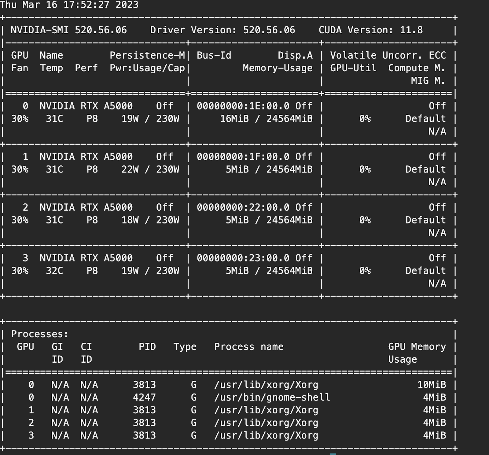
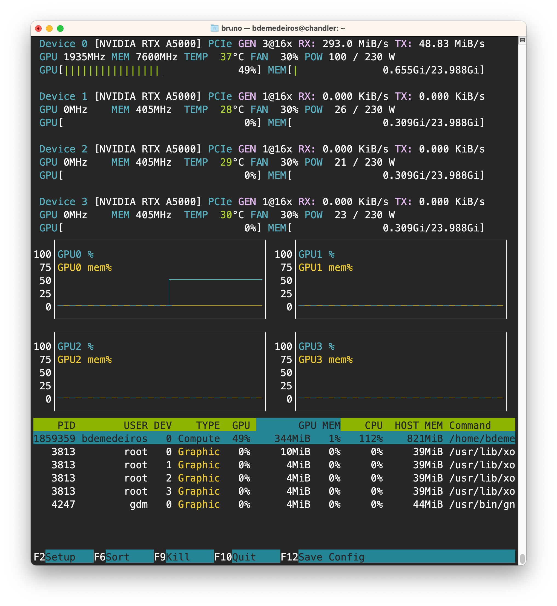

# Installing and running fastai and pytorch in the CHANDLER server

Chandler is the FMNH server with GPU capabilities. Currently, we have access to four A5000 GPUs. They are linked in pairs by an NVLink, meaning that data transfer within pairs is much faster than between pairs. This may be relevant for applications using more than one GPU. The IP address to CHANDLER is `10.100.111.203`.

## Accessing CHANDLER

You can access CHANDLER using SSH. Read [instructions on how to use jupyter](jupyter.md) to see how to work intereactively over SSH.

## Installing pytorch and fastai

First, you need to check the currently installed CUDA driver version in the server. After logging into CHANDLER, you can do this with `nvidia-smi`:


In this case, our CUDA version is 11.8, so we need to install pytorch with support to this CUDA version. 

The best way to install pytorch and fastai is using Anaconda. Check [initial setup instructions](../../initial_setup/README.md) to learn how to do it.

The following command install fastai, pytorch, jupyter lab and jupyter widgets (as of August 2023):
```bash
conda create -n fastai -c fastchan -c pytorch -c nvidia fastai pytorch-cuda=11.8 jupyterlab jupyterlab_widgets
```

After installing, you can activate with 
```
conda activate fastai
```

## Setting up GPU to use

The only thing you may have to do prior to start using fastai is to choose a GPU to use. By default, all 4 GPUs will be visible to pytorch. If one of them is being actively used by someone, it may be a good idea to use another GPU for your program. First, check GPU usage. This can be done with `nvtop` or `nvidia-smi`. The `nvidia-smi` output is show above. `nvtop` opens up a program similar to `top` but that focuses on live usage of GPUs. Here is an example:


In this case, GPU0 is being used by another program (about 49% of GPU cycle time and 821 MiB of memory), so it is better to choose a different GPU. To limit the GPUs visible by pytorch, you can set an environment variable named `CUDA_VISIBLE_DEVICES`. For example, if you type:

```bash
export CUDA_VISIBLE_DEVICES=1
```

Then pytorch and fastai will only see GPU 1 when use them in the same session. Use commas to separate devices if you are running an application that can use more than one GPU. For example: 

```bash
export CUDA_VISIBLE_DEVICES=2,3
```
Then GPUs 2 and 3 will be visible.

After setting `CUDA_VISIBLE_DEVICES` you can start jupyter lab. See [jupyter instructions](jupyter.md) on how to use it.


