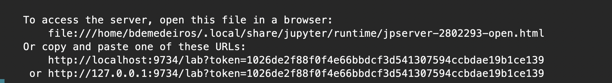

# Running jupyter notebooks

1. On the server (for example, Joey), make a conda environent including jupyterlab:
```bash
conda install -c conda-forge jupyterlab
```

2. start jupyter using option `--port`. The number can be any arbitrary 4-digit number. For example, `9734`:
```bash
jupyter lab --port 9734 
```

After this, a few messages will be shown, including a url with **localhost** in it. Something like this:


Copy the url with **localhost** in it (in the example above, `http://localhost:9734/lab?token=1026de2f88f0f4e66bbdcf3d541307594ccbdae19b1ce139`)


3. on your computer, open a new terminal window and connect to the server through ssh using the same port number you used in the server:
```bash
ssh -NL localhost:9734:localhost:9734 bdemedeiros@10.10.10.110
```

4. open a browser (e. g. Chrome) and put the url you copied in step 2 in the address bar.
